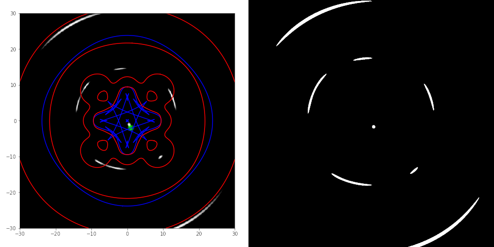

# Multiplane Lensing With CUDA

CUDA library for calculating beta vectors for multiplane lensing
situations using multiple Plummer lenses.

# Building

Build requirements:

	g++
	cmake
	cuda
	gtest (optional)

## Default

    cmake CMakeLists.txt
    make

## Debug

    cmake CMakeLists.txt -DCMAKE_BUILD_TYPE=DEBUG
    make

To build the unit tests you need to have GTest installed. If GTest is
not found, the tests are skipped.

### Running tests (CPU)

    ./bin/unit_tests

### Running tests (CUDA)

    ./bin/cu_unit_tests

# API

To use this library see `example/example.cpp`.

## Documentation

You can run `Doxygen` to generate the documentation. 

# Example

For the example there is a notebook that generates some test
parameters. A file generated by this notebook can be used as a test
file.

## Comparison sample GRALE2

Left: Grale2 result, right: this program (keep in mind we don't have
intensity and some other features.
